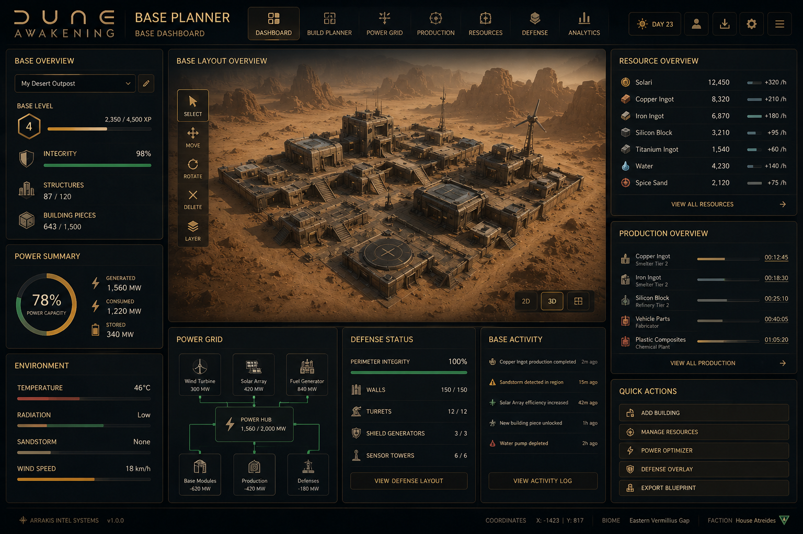
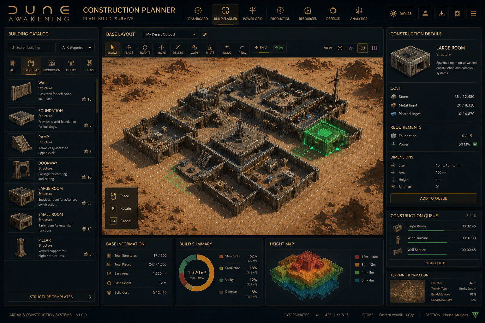
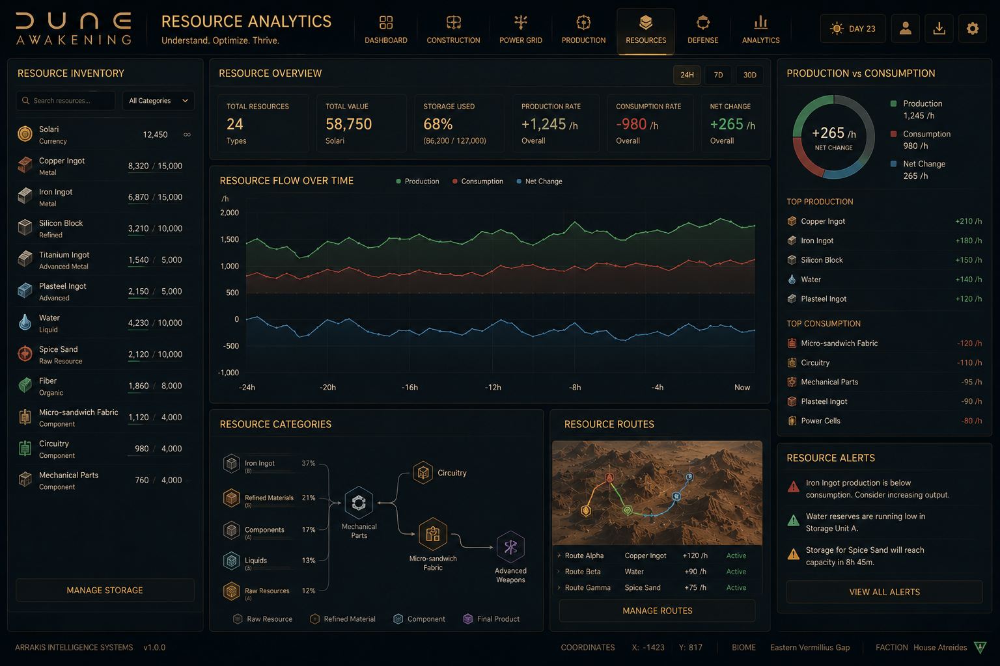

# Dune Awakening Base Planner — Free Desktop Tool for Windows
​
**The #1 base planning, base calculator, and resource management tool for Dune: Awakening players.**
​
[](https://github.com/AtomSheriffFoster/Dune-Awakening-Base-Planner/releases/latest)
[](https://github.com/AtomSheriffFoster/Dune-Awakening-Base-Planner/releases)
[](https://github.com/AtomSheriffFoster/Dune-Awakening-Base-Planner/releases/latest)
[](https://github.com/AtomSheriffFoster/Dune-Awakening-Base-Planner/releases/latest)
[](LICENSE)

​
---
​
## What is Dune Awakening Base Planner?
​
**Dune Awakening Base Planner** is a free Windows desktop application for planning, designing, and calculating your base in **Dune: Awakening**. It is the most complete offline **Dune Awakening base calculator** available — covering base layout design, power network planning, resource cost calculation, production chain optimization, and defense planning.
​
Whether you're setting up a Hagga Basin outpost or moving your entire **Deep Desert base** every week, this tool lets you plan everything in advance — so you build right the first time and waste zero materials.
​
**No browser required. No internet connection. No account. Just download and run.**
​
---
​
## ⬇️ Download Dune Awakening Base Planner
​
**Current version: v2.4.1 — Windows 10 / 11 (64-bit)**
​
### [Click here to download the latest release](https://github.com/AtomSheriffFoster/Dune-Awakening-Base-Planner/releases/latest)
​
```
1. Download Dune-Awakening-Base-Planner-v2.4.1.zip
2. Extract the archive to any folder
3. Run DuneAwakeningBasePlanner.exe
4. Start planning your base
```
​
> Works completely offline. No installation required.
​
---
​
## Features — Full Dune Awakening Base Calculator Suite
​
### 🏗️ Dune Awakening Base Layout Designer
​
Design your **Dune Awakening base layout** on a full modular grid before building anything in-game. Place every room, wall, staircase, and structure exactly where you want it. Test multiple layouts and switch between saved configurations.
​
### ⚡ Dune Awakening Power Calculator
​
Calculate **generator placement and power coverage** across your entire base. The power calculator shows consumption by zone, detects gaps, and helps you plan expansion without losing power mid-raid. Essential for **Deep Desert base planning** where every generator slot matters.
​
### 📦 Dune Awakening Base Cost Calculator & Resource Planner
​
Know your **base building costs** before you start. The **Dune Awakening resource calculator** models your full material requirements — Salvaged Metal, Steel Ingots, Copper, and every other resource — so you can prepare exactly what you need before heading to the Deep Desert.
​
### 📊 Production Chain Optimizer
​
Map out your entire **Dune Awakening production chain** — from raw resource nodes through refineries to final crafted items. Identify bottlenecks, plan storage, and optimize output at every stage.
​
### 🛡️ Defense Planner
​
Design your **Dune Awakening base defense** layout: turret placement, wall perimeters, choke points, and security zones. See attack angles before raiders do.
​
### 💾 Save, Load & Share Base Layouts
​
Store unlimited base configurations locally. Share layout files with clan members so everyone builds the same plan.
​
---
​
## Screenshots
​
### Base Layout Designer
​

​
### Resource & Cost Calculator
​

​
### Production Analytics Dashboard
​

​
---
​
## Who uses Dune Awakening Base Planner?
​
- **Deep Desert players** who need to plan a full base move every week without wasting resources
- **Solo survivors** building their first outpost and don't want to tear it down and rebuild
- **Clan leaders** coordinating a shared base build across multiple players
- **PvP players** who need to close every defensive gap before a raid hits
- **Builders** who want to experiment with Dune Awakening building layouts freely
​
---
​
## Frequently Asked Questions
​
**Is this tool free?**
Yes. Completely free. No subscriptions, no paywalls, no account needed.
​
**Does it work offline?**
Yes. The entire app runs locally on your Windows PC with no internet connection required.
​
**Is it updated for the current version of Dune: Awakening?**
Yes. The tool is updated alongside major game patches. Check [Releases](https://github.com/AtomSheriffFoster/Dune-Awakening-Base-Planner/releases) for the latest version.
​
**What are the system requirements?**
Windows 10 or Windows 11, 64-bit. No additional runtime or dependencies required.
​
**Is it safe to use?**
Yes. This is a standalone planning tool — it does not interact with the game client, does not modify game files, and does not require any elevated permissions.
​
---
​
## Related Dune: Awakening Resources
​
- [Dune: Awakening on Steam](https://store.steampowered.com/app/1172710/Dune_Awakening/)
- [r/duneawakening](https://www.reddit.com/r/duneawakening/) — Community tips, base designs, and guides
- [Dune: Awakening Wiki](https://awakening.wiki/) — Official community wiki
​
---
​
## Contributing
​
Found a bug or want to request a feature? [Open an issue](https://github.com/AtomSheriffFoster/Dune-Awakening-Base-Planner/issues).
​
Want to contribute code? Fork the repo, make your changes, and open a pull request against `main`.
​
---
​
## License
​
MIT License — free to use, fork, and modify. See [LICENSE](LICENSE).
​
---
​
**Dune Awakening Base Planner** — the free offline base calculator and layout designer for Dune: Awakening on Windows.
​
[](https://github.com/AtomSheriffFoster/Dune-Awakening-Base-Planner/releases/latest)
​
*Fan-made community tool. Not affiliated with Funcom or the Dune franchise.*
