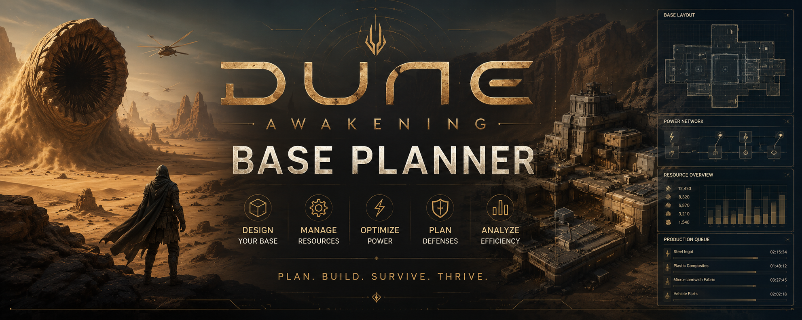

# Dune-Awakening-Base-Planner
Plan, design, and optimize your Dune Awakening base with resource management, power distribution, defense planning, and production tracking tools


# Dune Awakening Base Planner

<p align="center">
  
</p>

<h1 align="center">Dune Awakening Base Planner</h1>

<p align="center">
  Build smarter. Defend stronger. Survive longer on Arrakis.
</p>

---

## Design Your Perfect Base Before You Build It

Every wall matters.

Every generator matters.

Every resource route matters.

Dune Awakening Base Planner helps players design efficient bases, manage power networks, organize production chains, and prepare defensive layouts before committing valuable resources in-game.

Whether you're building a small outpost or a massive desert fortress, the planner helps you optimize every aspect of your settlement.

---

## Core Features

### Base Layout Designer

* Modular building planning
* Room organization
* Expansion previews
* Layout optimization

### Resource Management

* Resource requirements
* Production chains
* Material planning
* Storage tracking

### Power Network Planning

* Generator placement
* Power coverage
* Consumption analysis
* Expansion forecasting

### Defense Planning

* Defensive structures
* Perimeter layouts
* Security zones
* Strategic positioning

### Production Analytics

* Resource efficiency
* Production output
* Bottleneck detection
* Growth planning

---

## Screenshots

### Base Dashboard


### Construction Planner


### Resource Analytics


---

## Designed For

* Solo Players
* Clan Leaders
* Builders
* Resource Managers
* PvE Players
* PvP Players

---

## Download

Latest Release

```text
Dune-Awakening-Base-Planner-v2.4.1.zip
```

Executable

```text
DuneAwakeningBasePlanner.exe
```

---

## Arrakis Rewards Preparation

A well-planned base is the difference between survival and becoming another forgotten ruin beneath the sands.
